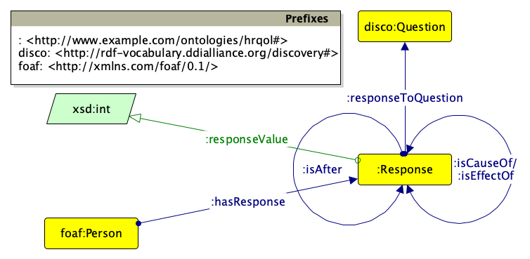

# Causal-HRQoL

## Scope

This repository contains parameter specifications for 7 distinct synthetic DAGs that represented causal structures related to 7 hypothetical HRQoL questionnaires.

## Ontology

The repository also contains the ontology for representing HRQoL questionnaires and responses, as well as cause-effect relationships between questions. The ontology is available in RDF TTL serialization format [here](hrqol.ttl), while the following diagram gives an overview that adheres to the [Graffoo specification](https://essepuntato.it/graffoo/specification/):

Below are the descriptions of the respective entities:

- `:hasResponse`: Associates a person/patient to a response they gave to a question in a questionnaire.
- `:isAfter`: Used for representing the sequence of questions.
- `:isCauseOf`: Indicates that the response to a question is the cause of the response to another question.
- `:isEffectOf`: Indicates that the response to a question is the effect of the response to another question.
- `:responseToQuestion`: Associates a response to a specific question in a questionnaire.
- `:responseValue`: Assigns an integer value to a response for a questionnaire question.
- `:Response`: Represents the response to a question in a questionnaire.